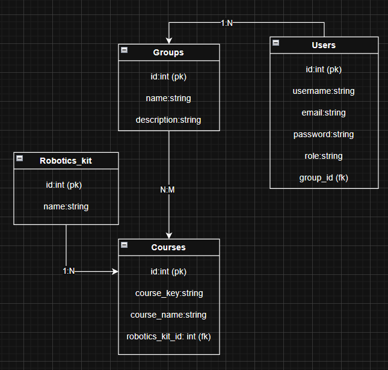

Activity 7 - Homework 6: Robotics academic platform
This project helps to manage the data of a robotics school: users such as students, administrators and teachers, groups, courses and robotic kits  by using Eloquent ORM. It already has some registers for users, robotic kits and courses.

